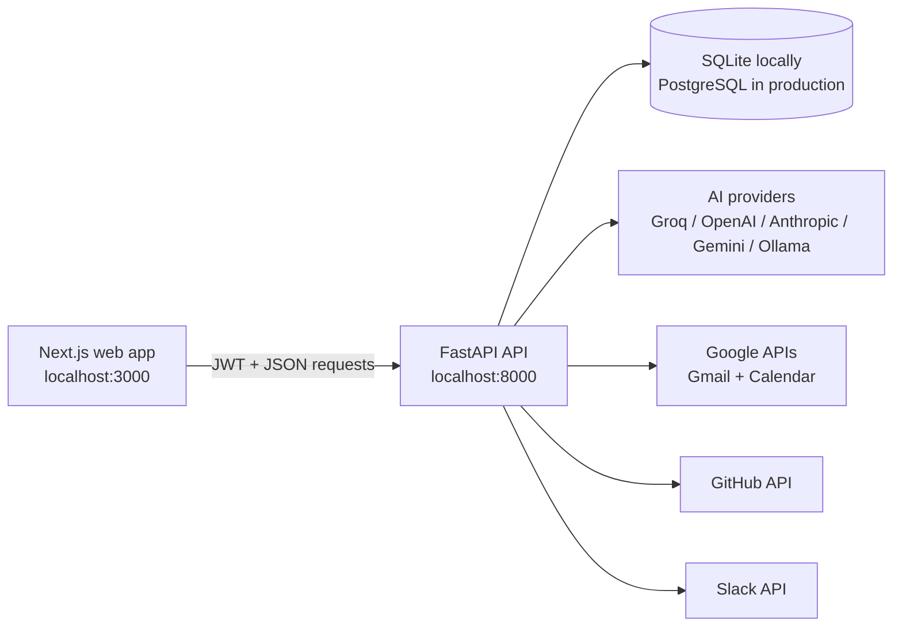

# Northstar Personal AI Workspace

## Complete Project Guide

**Version:** 1.0.0
**Project type:** Multi-user personal productivity and AI assistant web application
**Frontend:** Next.js 16, React 18, TypeScript, Tailwind CSS
**Backend:** FastAPI, Python 3.11+, SQLAlchemy 2
**Local database:** SQLite
**Production database:** PostgreSQL

---

## 1. What this project is

Northstar is a private personal AI workspace that brings tasks, projects, email, calendar events, notifications, saved memory, connected accounts, search, and an AI assistant into one web application.

The main goal is to reduce context switching. Instead of checking several applications separately, a user can open Northstar to see what needs attention and ask natural-language questions such as:

- “What should I do next?”
- “What is my latest email?”
- “Show my recent emails.”
- “What is on my calendar tomorrow?”
- “Give me a morning brief.”
- “Prepare me for my next meeting.”
- “Show my GitHub repositories.”
- “Do I have any open pull requests?”
- “Remember that I prefer short morning meetings.”

Northstar is designed as an approval-first assistant. It reads connected context and prepares information or drafts, but it does not silently execute important external actions.

---

## 2. What the application does

### Account and onboarding

- Registers users with email and password.
- Authenticates users using JWT bearer tokens.
- Provides a guided onboarding flow.
- Lets users update their name, profile details, and password.
- Supports account deletion.
- Keeps every user’s tasks, projects, integrations, memory, notifications, and AI settings isolated by user ID.

### Overview dashboard

- Presents the main workspace summary.
- Surfaces current work, priorities, and connected context.
- Provides quick navigation to inbox, tasks, calendar, projects, assistant, search, integrations, notifications, and settings.

### Tasks

- Create, view, update, complete, cancel, and delete tasks.
- Assign a task to a project.
- Store priority, status, due date, reminder time, estimated duration, description, and source.
- Filter and organize tasks by state and urgency.
- Let the assistant use task data when recommending what to do next.

Supported task statuses:

- `todo`
- `in_progress`
- `completed`
- `cancelled`

Supported priorities:

- `low`
- `medium`
- `high`
- `urgent`

### Projects

- Create, edit, archive, and delete projects.
- Add descriptions and colors.
- Associate tasks with projects.
- Separate active work from archived projects.

### Gmail inbox

- Connect Gmail through Google OAuth using read-only Gmail permission.
- Alternatively connect Gmail through an app password.
- Read and list recent messages.
- Identify urgent and action-needed messages.
- Answer direct inbox questions in the assistant, including latest-email requests.
- Generate a reply draft for review.
- Never send email automatically.

### Google Calendar

- Connect Google Calendar through Google OAuth.
- Read events with read-only calendar permission.
- Show today’s schedule.
- Show events for an arbitrary date.
- Answer date-aware assistant questions such as today, tomorrow, or a supplied date.
- Use the browser’s timezone offset so “today” and “tomorrow” match the user’s local day.

### GitHub

- Connect through GitHub OAuth or a compatible personal access token.
- Read the signed-in GitHub account.
- List visible repositories.
- Include private repositories when the granted token has permission.
- Retrieve open pull requests and assigned issues.
- Answer GitHub-specific questions directly inside the assistant.

### Slack

- Accept and validate a Slack User OAuth token beginning with `xoxp-`.
- Require the `search:read` user scope before marking the connection active.
- Retrieve recent `to:me` mention context using Slack search.
- Answer recent and latest Slack-mention questions in the assistant.
- Expose Slack notification preferences.

Slack support is intentionally read-only and limited to mention search. Northstar does not act as a complete Slack client and does not post messages.

### AI assistant

The assistant combines deterministic workspace actions with an AI model:

- Inbox summaries and latest-email questions use live Gmail data.
- Calendar questions use live Google Calendar data.
- GitHub questions use live GitHub data.
- Slack mention questions use live Slack search data.
- Priority questions use saved tasks and workspace context.
- Morning briefs combine the available workspace signals.
- Meeting-preparation questions use calendar context.
- Memory questions can save and retrieve user facts.
- General questions use the configured AI provider.

The default Groq model configuration is:

- Fast: `openai/gpt-oss-20b`
- Balanced: `openai/gpt-oss-120b`
- Quality: `openai/gpt-oss-120b`

The application also supports OpenAI, Anthropic, Gemini, Ollama, and custom-compatible model settings.

### Saved memory

- Store durable facts or preferences for the assistant.
- Edit, deactivate, or delete memories.
- Categorize memories as preferences, projects, contacts, decisions, or routines.
- Keep memory private to the authenticated user.

### Unified search

- Search tasks.
- Search projects.
- Search saved memories.
- Return results in one workspace search experience.

The repository contains document/RAG-related dependencies and legacy folders, but the current web search endpoint is focused on the authenticated user’s tasks, projects, and memories. Document ingestion is not yet a complete end-user web workflow.

### Notifications

- List user notifications.
- Mark one notification as read.
- Mark all notifications as read.
- Configure preferences for email, calendar, tasks, Slack, GitHub, and daily-review categories.

### AI settings / bring your own key

- Use the platform AI configuration when enabled.
- Save a per-user provider and API key.
- Select a model and mode.
- Test AI credentials before relying on them.
- Encrypt saved API keys at rest.

---

## 3. Main navigation

| Page | URL | Purpose |
|---|---|---|
| Overview | `/` | Workspace summary and quick actions |
| Inbox | `/inbox` | Gmail messages, triage, and reply drafting |
| Tasks | `/tasks` | Personal task management |
| Calendar | `/calendar` | Today and date-based schedules |
| Projects | `/projects` | Project organization |
| Assistant | `/assistant` | Natural-language workspace assistant |
| Search | `/search` | Search tasks, projects, and memories |
| Integrations | `/integrations` | Connect Gmail, Calendar, GitHub, and Slack |
| Notifications | `/notifications` | Alerts and read state |
| Settings | `/settings` | Profile, AI, preferences, password, and account settings |
| Login | `/login` | Existing-user authentication |
| Register | `/register` | New-user registration |
| Onboarding | `/onboarding` | Initial workspace setup |

---

## 4. System architecture



### Request flow

1. The user signs in through the Next.js frontend.
2. The backend validates the password and returns a JWT access token.
3. The frontend sends the token with protected API requests.
4. The backend scopes every database query to the authenticated user.
5. Integration credentials are decrypted only when the backend needs to call the provider.
6. The assistant routes recognizable workspace questions to live data handlers and sends open-ended questions to the configured AI model.

---

## 5. Repository structure

```text
personal-ai-assistant/
├── agents/                 # Assistant state, graphs, tools, and model factory
├── backend/
│   ├── api/v1/             # REST API route modules
│   ├── auth/               # JWT, password hashing, and dependencies
│   ├── db/                 # SQLAlchemy base and async database session
│   ├── integrations/       # Gmail, Calendar, GitHub, and Slack clients
│   ├── models/             # Database models
│   ├── services/           # OAuth and supporting services
│   ├── config.py           # Environment-based application settings
│   └── main.py             # FastAPI application entry point
├── frontend/
│   ├── app/                # Next.js App Router pages
│   ├── components/         # Shared UI components
│   ├── lib/                # API client and frontend helpers
│   └── public/             # Static assets
├── tests/                  # Automated backend tests
├── documents/              # Legacy/experimental document area
├── rag/                    # Legacy/experimental RAG components
├── .env.example            # Safe configuration template
├── docker-compose.yml      # Production-like multi-container stack
├── Dockerfile.backend      # Backend container
├── requirements.txt        # Python dependencies
├── package.json            # Root convenience commands
├── README.md               # Short project introduction
└── PROJECT_GUIDE.md        # This complete guide
```

The current product is a Next.js + FastAPI web application. Streamlit is not part of the active runtime.

---

## 6. Database and stored data

| Model | What it stores |
|---|---|
| `User` | Email, hashed password, profile fields, active state, and onboarding state |
| `Task` | Title, description, status, priority, due date, reminder, estimate, source, and project |
| `Project` | Name, description, color, and active/archive state |
| `IntegrationAccount` | Provider, account label, encrypted tokens, scopes, status, and errors |
| `Memory` | Categorized personal facts and active state |
| `Notification` | Category, severity, content, link, and read/dismissed state |
| `NotificationPreference` | Per-category notification switches and review times |
| `AICredential` | Encrypted API key, provider, model, mode, base URL, and fallback setting |
| `AuditLog` | Action type, target service, summary, and structured details |

Local development uses `workspace.db`, which is excluded from Git. The FastAPI startup process creates missing tables automatically. For production, use PostgreSQL and a proper migration strategy before making future schema changes.

---

## 7. Security model

- Passwords are stored as password hashes, never as plaintext.
- Protected API routes require a valid JWT.
- Application records are filtered by authenticated user ID.
- OAuth access tokens, refresh tokens, and user AI keys are encrypted at rest with Fernet.
- OAuth state values are signed, provider-bound, user-bound, and expire after ten minutes.
- Google access is read-only for Gmail and Calendar.
- External actions are approval-first; email reply generation creates a draft for review and does not send it.
- Production startup rejects the known development JWT and encryption secrets.
- CORS origins are controlled through environment configuration.
- `.env`, local databases, token folders, secret folders, dependency folders, and build artifacts are ignored by Git.

### Security rules for operators

1. Never commit `.env`.
2. Never place real credentials in `.env.example`.
3. Generate new production values for `JWT_SECRET` and `ENCRYPTION_KEY`.
4. Use HTTPS for the frontend, API, and OAuth callbacks in production.
5. Use the narrowest practical OAuth permissions.
6. Revoke credentials immediately if they appear in logs, screenshots, Git history, or shared files.
7. Treat the legacy `tokens/` and `secrets/` directories as local-only artifacts. They are ignored and are not the source of multi-user web credentials.

Generate a Fernet key with:

```powershell
python -c "from cryptography.fernet import Fernet; print(Fernet.generate_key().decode())"
```

Generate a JWT secret with:

```powershell
python -c "import secrets; print(secrets.token_urlsafe(48))"
```

---

## 8. Local setup on Windows

### Prerequisites

- Python 3.11 or newer
- Node.js 20.9 or newer
- npm
- A modern browser
- Google and GitHub developer credentials only if those integrations are needed

### 1. Open PowerShell in the project

```powershell
cd E:\RAG\personal-ai-assistant
```

### 2. Create and activate the Python environment

```powershell
python -m venv .venv
.\.venv\Scripts\Activate.ps1
```

If PowerShell blocks activation, either use the virtual-environment Python directly or allow local scripts for the current user according to your organization’s policy.

### 3. Install backend dependencies

```powershell
python -m pip install --upgrade pip
python -m pip install -r requirements.txt
```

### 4. Install frontend dependencies

```powershell
npm install --prefix frontend
```

### 5. Create the environment file

```powershell
Copy-Item .env.example .env
```

Edit `.env` and replace secrets and provider credentials. Never paste secret values into this guide.

### 6. Start the backend

Open one PowerShell window:

```powershell
cd E:\RAG\personal-ai-assistant
.\.venv\Scripts\python.exe -m uvicorn backend.main:app --reload --port 8000
```

### 7. Start the frontend

Open a second PowerShell window:

```powershell
cd E:\RAG\personal-ai-assistant
npm run dev
```

### 8. Open the application

- Web application: `http://localhost:3000`
- Backend health: `http://localhost:8000/health`
- Interactive API documentation: `http://localhost:8000/docs`
- Alternative API documentation: `http://localhost:8000/redoc`

---

## 9. Environment variables

| Variable | Required | Purpose |
|---|---:|---|
| `ENVIRONMENT` | Yes | Use `development` locally and `production` when deployed |
| `DEBUG` | Yes | Enables development-level behavior and logging |
| `PORT` | Optional | Documented backend port; Uvicorn command controls the actual local port |
| `API_PREFIX` | Yes | API base path, normally `/api/v1` |
| `FRONTEND_URL` | Yes | Public frontend origin |
| `BACKEND_PUBLIC_URL` | Yes | Public API origin used to construct OAuth callback URLs |
| `CORS_ORIGINS` | Yes | JSON list of allowed browser origins |
| `DATABASE_URL` | Yes | Async SQLite or PostgreSQL connection string |
| `REDIS_URL` | Production stack | Redis connection for supporting infrastructure |
| `JWT_SECRET` | Yes | Signs access tokens and OAuth state |
| `ACCESS_TOKEN_EXPIRE_MINUTES` | Optional | JWT lifetime; default is seven days |
| `ENCRYPTION_KEY` | Yes | Encrypts OAuth tokens and AI credentials |
| `USE_PLATFORM_AI` | Yes | Enables the server-configured AI provider |
| `GROQ_API_KEY` | One AI provider | Groq platform key |
| `OPENAI_API_KEY` | One AI provider | OpenAI platform key |
| `ANTHROPIC_API_KEY` | One AI provider | Anthropic platform key |
| `GEMINI_API_KEY` | One AI provider | Google Gemini platform key |
| `OLLAMA_BASE_URL` | For Ollama | Local or remote Ollama base URL |
| `LANGSMITH_TRACING` | Optional | Enables LangSmith tracing |
| `LANGSMITH_API_KEY` | Optional | LangSmith credential |
| `LANGSMITH_PROJECT` | Optional | LangSmith project name |
| `GOOGLE_CLIENT_ID` | Google OAuth | Google OAuth web client ID |
| `GOOGLE_CLIENT_SECRET` | Google OAuth | Google OAuth client secret |
| `GITHUB_CLIENT_ID` | GitHub OAuth | GitHub OAuth App client ID |
| `GITHUB_CLIENT_SECRET` | GitHub OAuth | GitHub OAuth App client secret |
| `SLACK_CLIENT_ID` | Future OAuth expansion | Reserved Slack app client ID |
| `SLACK_CLIENT_SECRET` | Future OAuth expansion | Reserved Slack app client secret |
| `NEXT_PUBLIC_API_URL` | Separate frontend host | Browser-facing API base, such as `https://api.example.com/api/v1` |

For zero-configuration local development, the backend defaults to:

```env
DATABASE_URL=sqlite+aiosqlite:///./workspace.db
FRONTEND_URL=http://localhost:3000
BACKEND_PUBLIC_URL=http://localhost:8000
```

---

## 10. Google OAuth setup

One Google OAuth client can support both Gmail and Google Calendar.

### Google Cloud Console steps

1. Create or select a Google Cloud project.
2. Open **APIs & Services → Library**.
3. Enable the **Gmail API**.
4. Enable the **Google Calendar API**.
5. Configure the **OAuth consent screen**.
6. If the app is in testing mode, add the Google account as a test user.
7. Open **Credentials → Create credentials → OAuth client ID**.
8. Select **Web application**.
9. Add the exact authorized redirect URI:

```text
http://localhost:8000/api/v1/integrations/google/callback
```

10. Add the credentials to `.env`:

```env
GOOGLE_CLIENT_ID=your-client-id
GOOGLE_CLIENT_SECRET=your-client-secret
BACKEND_PUBLIC_URL=http://localhost:8000
```

11. Restart the backend after editing `.env`.
12. Open **Integrations**, select Gmail or Google Calendar, choose OAuth, and continue.

Google permissions requested by the app:

- Basic identity: `openid`, `email`, `profile`
- Gmail: `gmail.readonly`
- Calendar: `calendar.readonly`

Gmail and Calendar are stored as separate Northstar connections. Authorizing one does not automatically create the other, even though they use the same Google OAuth client.

---

## 11. GitHub OAuth setup

### GitHub steps

1. Sign in to the GitHub account that will own the OAuth App.
2. Open **Settings → Developer settings → OAuth Apps**.
3. Select **New OAuth App**.
4. Use values similar to:

```text
Application name: Northstar Personal AI Workspace
Homepage URL: http://localhost:3000
Authorization callback URL: http://localhost:8000/api/v1/integrations/github/callback
```

5. Create the app.
6. Copy the Client ID.
7. Generate a Client Secret.
8. Add both values to `.env`:

```env
GITHUB_CLIENT_ID=your-client-id
GITHUB_CLIENT_SECRET=your-client-secret
BACKEND_PUBLIC_URL=http://localhost:8000
```

9. Restart the backend.
10. Start a fresh connection from Northstar’s **Integrations** page.

GitHub permissions requested:

- `read:user`
- `user:email`
- `repo`

The `repo` scope is required when the assistant should see private repositories. If an organization restricts third-party OAuth applications, an organization owner may also need to approve the app.

Do not reuse or refresh an old callback page. OAuth authorization codes are short-lived and intended for one exchange. Start a new connection from Northstar if a callback fails.

---

## 12. Discord bot setup

Discord uses a bot token rather than a personal user token. The connection is read-only and limited to an explicit channel allow-list.

### Discord Developer Portal steps

1. Open the [Discord Developer Portal](https://discord.com/developers/applications).
2. Create an application and add a bot.
3. On the bot page, enable **Message Content Intent** so message bodies are available.
4. Open **OAuth2 → URL Generator**.
5. Select the `bot` scope.
6. Grant only these permissions:
   - **View Channels**
   - **Read Message History**
7. Open the generated URL and invite the bot to the intended server.
8. Copy or reset the bot token from the bot page.
9. In Northstar, open **Integrations → Discord → Connect**, paste the bot token, and continue.
10. Select up to 10 channels in the configuration dialog and save.

Northstar stores the bot token encrypted and queries Discord API v10 from the backend. It never exposes the token to the frontend after connection. There are no Discord message-posting endpoints, and the assistant reads only channels saved in the allow-list.

If no channels appear, confirm the bot is in the server and can view the relevant text channels. If message entries appear without content, enable Message Content Intent and reconnect if necessary.

---

## 13. API reference

All protected endpoints require:

```http
Authorization: Bearer <access-token>
```

### Authentication

| Method | Endpoint | Purpose |
|---|---|---|
| `POST` | `/api/v1/auth/register` | Create an account |
| `POST` | `/api/v1/auth/login` | Sign in and obtain a JWT |
| `GET` | `/api/v1/auth/me` | Return the current user |
| `POST` | `/api/v1/auth/complete-onboarding` | Mark onboarding complete |
| `PUT` | `/api/v1/auth/profile` | Update profile |
| `PUT` | `/api/v1/auth/change-password` | Change password |
| `DELETE` | `/api/v1/auth/account` | Delete the current account |

### Assistant and AI

| Method | Endpoint | Purpose |
|---|---|---|
| `POST` | `/api/v1/assistant/chat` | Ask a workspace or general AI question |
| `GET` | `/api/v1/ai-settings` | Read current AI configuration |
| `POST` | `/api/v1/ai-settings` | Save per-user AI configuration |
| `POST` | `/api/v1/ai-settings/test` | Validate provider credentials/model access |

### Inbox and calendar

| Method | Endpoint | Purpose |
|---|---|---|
| `GET` | `/api/v1/inbox` | Return inbox messages and triage data |
| `POST` | `/api/v1/inbox/draft-reply` | Generate a reply draft for review |
| `GET` | `/api/v1/calendar/today` | Return today’s events |
| `GET` | `/api/v1/calendar/day?date=YYYY-MM-DD` | Return events for a supplied date |

### Integrations

| Method | Endpoint | Purpose |
|---|---|---|
| `GET` | `/api/v1/integrations` | List integration availability and connection status |
| `POST` | `/api/v1/integrations/{provider}/connect` | Save/validate a direct credential or token |
| `GET` | `/api/v1/integrations/{provider}/oauth-url` | Begin OAuth |
| `GET` | `/api/v1/integrations/google/callback` | Complete Gmail or Calendar OAuth |
| `GET` | `/api/v1/integrations/github/callback` | Complete GitHub OAuth |
| `GET` | `/api/v1/integrations/discord/channels` | List Discord text channels visible to the connected bot |
| `PUT` | `/api/v1/integrations/discord/channels` | Save the Discord channel allow-list |
| `POST` | `/api/v1/integrations/{provider}/disconnect` | Disconnect a provider |

Provider IDs are `gmail`, `google_calendar`, `github`, `slack`, and `discord`.

### Tasks and projects

| Method | Endpoint | Purpose |
|---|---|---|
| `GET` / `POST` | `/api/v1/tasks` | List or create tasks |
| `GET` / `PATCH` / `DELETE` | `/api/v1/tasks/{task_id}` | Read, edit, or delete a task |
| `GET` / `POST` | `/api/v1/projects` | List or create projects |
| `PATCH` / `DELETE` | `/api/v1/projects/{project_id}` | Edit or delete a project |

### Memory, search, and notifications

| Method | Endpoint | Purpose |
|---|---|---|
| `GET` / `POST` | `/api/v1/memories` | List or create memories |
| `PATCH` / `DELETE` | `/api/v1/memories/{memory_id}` | Edit or delete a memory |
| `GET` | `/api/v1/search` | Search user workspace records |
| `GET` | `/api/v1/notifications` | List notifications |
| `POST` | `/api/v1/notifications/{notification_id}/read` | Mark one notification read |
| `POST` | `/api/v1/notifications/mark-all-read` | Mark all notifications read |
| `GET` / `PATCH` | `/api/v1/notifications/preferences` | Read or update preferences |

---

## 14. Testing and verification

### Backend tests

```powershell
cd E:\RAG\personal-ai-assistant
.\.venv\Scripts\python.exe -m pytest -q
```

Current verification snapshot on 30 August 2026:

```text
44 passed
```

The test suite covers authentication, tenant isolation, integrations, assistant routing, date-aware calendar behavior, GitHub and Discord behavior, security boundaries, and core API features.

### Frontend production build

```powershell
cd E:\RAG\personal-ai-assistant
npm run build
```

Run this before deployment to catch TypeScript, route, and production-bundling failures.

### Manual smoke test

1. Check `http://localhost:8000/health` returns `status: ok`.
2. Register a new account.
3. Complete onboarding.
4. Create a project and task.
5. Save a memory.
6. Search for the task or memory.
7. Connect Gmail and verify recent messages appear.
8. Connect Calendar and ask the assistant about tomorrow.
9. Connect GitHub and ask for visible repositories.
10. Configure/test an AI provider and ask an open-ended question.
11. Sign out and sign back in.

---

## 15. Docker deployment

The included Docker Compose stack runs:

- PostgreSQL 16
- Redis 7
- FastAPI backend on port 8000
- Next.js frontend on port 3000

Before starting it, set production-safe secrets and a PostgreSQL password in `.env`.

```powershell
docker compose up --build
```

Stop the stack without deleting its named data volumes:

```powershell
docker compose down
```

The containers include health checks, and the frontend waits for the backend health check before starting.

### Production checklist

- Set `ENVIRONMENT=production` and `DEBUG=false`.
- Replace the development JWT and encryption values.
- Set a strong `POSTGRES_PASSWORD`.
- Use PostgreSQL rather than the local SQLite file.
- Set exact public HTTPS values for `FRONTEND_URL` and `BACKEND_PUBLIC_URL`.
- Restrict `CORS_ORIGINS` to the deployed frontend.
- Update Google and GitHub callback URLs to the production API URL.
- Keep credentials in a deployment secret manager.
- Run the backend tests and frontend production build.
- Put a TLS-terminating reverse proxy or managed platform in front of both services.
- Configure backups and monitoring.
- Review provider scopes and rotate secrets periodically.

---

## 16. Troubleshooting

### “Backend unavailable” or pages contain no data

1. Open `http://localhost:8000/health`.
2. If it does not load, restart Uvicorn from the project root.
3. Confirm the frontend is running at `http://localhost:3000`.
4. Confirm `.env` uses the same host names shown in the OAuth callbacks.
5. Check the backend terminal for the actual error.

### Integration says “OAuth setup required” after editing `.env`

- Make sure `.env` is in the project root, not inside `backend/` or `frontend/`.
- Confirm the variable names are exact.
- Do not wrap copied values in accidental extra quotes or spaces.
- Fully stop and restart the backend; changing `.env` does not update an already-running process reliably.
- Open a new integration dialog after the restart.

### Google returns `redirect_uri_mismatch`

The Google Cloud redirect URI must exactly match:

```text
http://localhost:8000/api/v1/integrations/google/callback
```

Protocol, host, port, path, and trailing slash all matter. `localhost` and `127.0.0.1` are different OAuth redirect URIs.

### Google connects, but Gmail or Calendar cannot synchronize

- Make sure the corresponding Gmail API or Calendar API is enabled.
- Reconnect the specific provider so Google grants the correct scope.
- Gmail and Calendar need separate authorization entries inside Northstar.
- If the consent screen is in testing mode, confirm the account is a test user.
- If scopes changed, revoke the app in the Google account and reconnect to force fresh consent.
- Review the integration error displayed by the API rather than assuming a connected badge means the latest provider call succeeded.

### GitHub login or callback fails

- Confirm the callback URL belongs to the GitHub OAuth App, not a Google social-login callback.
- Use a fresh connection attempt; do not refresh an old callback URL.
- If GitHub says the account does not support password sign-in, use that account’s supported sign-in method, passkey, recovery flow, or an already authenticated private window.
- Clear stale GitHub cookies or try a private window if GitHub keeps selecting the wrong identity.
- Confirm the OAuth App credentials in `.env` match the app whose callback was configured.

### GitHub is connected, but the assistant says it cannot access GitHub

- Refresh the Northstar page after connection.
- Ask a direct question such as “Show my GitHub repositories.”
- Confirm the integration status is connected and does not show “needs attention.”
- Reconnect if the token was revoked or the organization requires approval.
- Check backend logs for GitHub API status codes.

### Assistant repeats a generic inbox answer

- Confirm Gmail synchronization succeeds.
- Ask a specific question such as “What is my latest email?” or “List my five recent emails.”
- Ensure the backend running on port 8000 is the latest project process, not an older Uvicorn process.
- Reload the frontend after restarting the backend.

### Assistant says it has no calendar access although Calendar is connected

- Confirm the Google Calendar connection itself shows connected, not only Gmail.
- Reconnect Calendar to refresh the read-only calendar scope.
- Ask a date-specific question.
- Check that the browser sends the local timezone offset and that the backend is current.

### AI provider returns a model-not-found error

- Test the provider in Settings.
- Confirm the selected model exists for that provider and account.
- For the default Groq configuration, use the current `openai/gpt-oss-20b` or `openai/gpt-oss-120b` model IDs.
- Confirm the API key is active and has available quota.
- Restart the backend after changing platform-level AI environment variables.

### Port 3000 or 8000 is already in use

Find the process in PowerShell:

```powershell
Get-NetTCPConnection -LocalPort 3000,8000 -State Listen | Select-Object LocalPort,OwningProcess
```

Inspect the process before stopping anything:

```powershell
Get-Process -Id <process-id>
```

Only stop it if it is the stale Northstar process you intended to replace.

---

## 17. Current limitations

- Slack connection, validated `search:read` scope, mention retrieval, and assistant responses are implemented; broader channel browsing and message posting are intentionally out of scope.
- Document upload, chunking, embeddings, and semantic document Q&A are not yet a complete web feature, despite legacy RAG code and dependencies in the repository.
- Assistant conversations do not currently provide a durable, user-visible history of full multi-turn threads across browser sessions.
- Gmail reply generation is draft-only; sending and mailbox mutation are intentionally not automated.
- Google integrations are read-only; the app does not create or modify calendar events.
- GitHub support is read-oriented; it does not merge pull requests, modify repositories, or post changes.
- Discord support is read-only and limited to 10 explicitly selected text channels per account; it does not post or modify messages.
- PostgreSQL tables are created automatically, but a formal migration tool should be added before frequent production schema changes.
- Redis is included in the deployment stack, but the core local experience does not depend heavily on background jobs or queues yet.

These limitations are deliberate places for future development and should not be presented to users as already completed features.

---

## 18. Recommended next improvements

1. Add persistent assistant conversation history.
2. Finish document upload and retrieval-augmented generation in the web interface.
3. Add an optional one-click Slack OAuth flow for self-hosted deployments.
4. Add Alembic database migrations.
5. Add background synchronization and scheduled notification workers.
6. Add browser end-to-end tests for login, OAuth status, tasks, and assistant flows.
7. Add production observability, structured audit-log views, and automated backups.
8. Add token revocation and refresh monitoring where providers support it.

---

## 19. Product status

The application is a working full-stack MVP, not a static mockup:

- The frontend and backend are connected.
- Authentication and user isolation are implemented.
- Core productivity CRUD features are implemented.
- Gmail, Google Calendar, GitHub, and Discord are connected to live provider APIs.
- The assistant can route supported workspace questions to live data.
- AI provider configuration is implemented.
- The automated backend suite currently passes all 44 tests.

Production deployment still requires operator-owned secrets, public HTTPS URLs, production OAuth callbacks, a PostgreSQL instance, monitoring, backups, and the production checklist above.

---

## 20. Quick command reference

```powershell
# Backend development server
.\.venv\Scripts\python.exe -m uvicorn backend.main:app --reload --port 8000

# Frontend development server
npm run dev

# Backend tests
.\.venv\Scripts\python.exe -m pytest -q

# Frontend production build
npm run build

# Docker stack
docker compose up --build
```

---

## 21. License

This repository is currently private/proprietary unless a separate `LICENSE` file states otherwise. Add an explicit license before distributing the project publicly.
