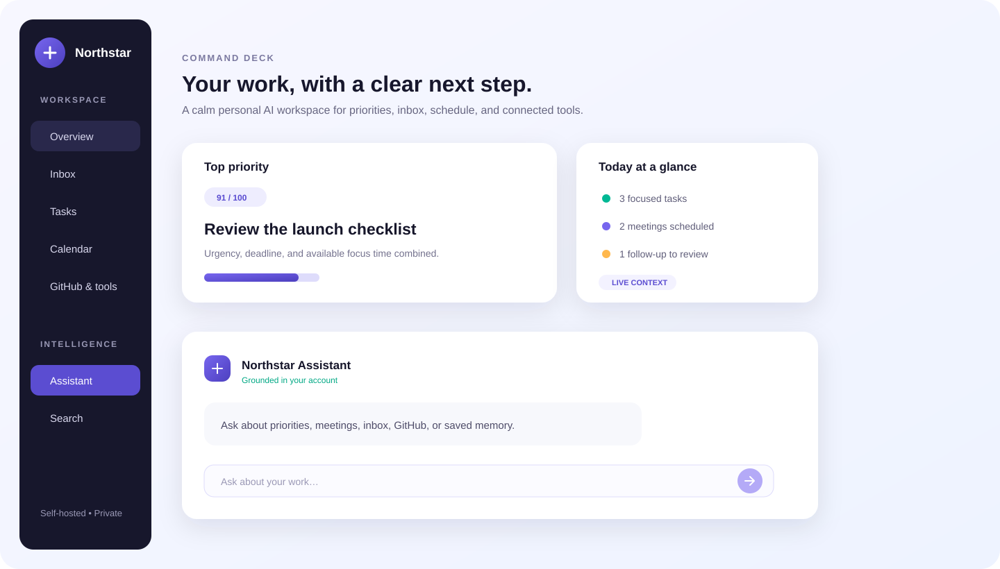
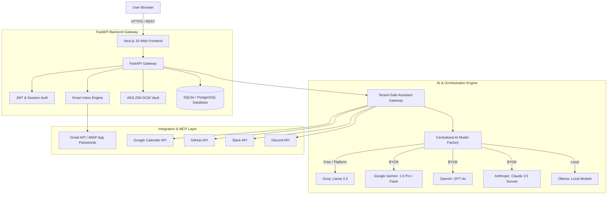

# Northstar — Personal AI Workspace

[](https://nextjs.org/)
[](https://fastapi.tiangolo.com/)
[](https://github.com/langchain-ai/langgraph)
[](https://sqlite.org/)
[](https://github.com/ZubairAbbas1/northstar-personal-ai-workspace/actions/workflows/ci.yml)
[](LICENSE)

An open-source, self-hosted, multi-user **AI Executive Assistant & Productivity Workspace** designed around one core mission:

> **"One intelligent workspace that understands what is happening across your work and helps you determine what deserves your attention next."**

Built with **Next.js 16 (TypeScript and Tailwind CSS)**, **FastAPI (Python 3.11)**, a tenant-safe assistant gateway, **Model Context Protocol (MCP)** workflows, and an **AES-256-GCM BYOK Vault**.

## Self-hosted by design

Northstar does not require a Northstar cloud account, paid domain, or centrally hosted service. Each person can clone or download this repository and run the frontend and backend on their own computer. Their accounts, database, memories, and encrypted integration credentials remain in that installation.

Provider credentials are deliberately not bundled in the public repository. A self-hoster creates their own Google and GitHub OAuth applications and puts those client credentials in their local `.env`; Northstar then lets every user of that installation authorize their own provider account. Discord uses a user-created bot token, and AI can use a local Ollama model or the self-hoster's provider key.

See [SELF_HOSTING.md](SELF_HOSTING.md) for the complete localhost installation and connection guide.

## Product preview

The workspace brings your assistant, priorities, and connected work context into one calm command deck:



This screenshot is a sanitized demo capture with no real email, calendar, or message content. See the [screenshots guide](screenshots/README.md) for the planned demo capture set.

---

## 🌟 What Makes This Special?

### 1. 🎯 Signature Feature — "What Should I Do Next?"
- **Deterministic Mathematical Scoring**: Replaces random LLM guessing with a transparent **0–100 priority algorithm**:
  - **Deadline Urgency**: Overdue (+35 pts), due today (+28 pts), due tomorrow (+18 pts).
  - **Task Priority Weight**: Urgent (+30 pts), high (+22 pts), medium (+12 pts).
  - **Free Calendar Window Fit**: Calculates minutes until your next meeting; awards +15 pts if task fits.
  - **Email Blocker / Client Link**: +20 pts if an active client email matches task keywords.
- **AI Executive Explanation**: Transparent reasoning detailing *why* the top task was chosen and time guidance.

### 2. 📥 Smart Inbox Triage & AI Draft Synthesis
- **Intelligent Classification**: Categorizes emails into `urgent`, `action_needed`, `fyi`, and `ignore`.
- **Live Sync**: Supports live Gmail through a **Google App Password** or the official **Google OAuth 2.0** flow.
- **Executive Draft Synthesis**: 1-click generation of professional draft replies and instant conversion of emails into prioritized workspace tasks.

### 3. 🤝 Meeting Preparation
- **Attendee Cross-Referencing**: Identifies your next scheduled calendar meeting and searches recent email threads and PRs involving attendees.
- **Contextual Briefings**: Delivers purpose, outstanding deliverables, and strategic questions worth asking.

### 4. 🔑 Multi-Provider AI Engine & BYOK
- **Supported Providers**: Groq (Llama 3.3), Google Gemini (1.5 Flash/Pro), OpenAI (GPT-4o), Anthropic (Claude 3.5 Sonnet), and local Ollama.
- **Zero-Friction Default**: Run instantly with free platform models or local offline models.
- **Bank-Grade Key Security**: All BYOK keys and OAuth tokens are symmetrically encrypted at rest using **AES-256-GCM / Fernet**.

### 5. Calm, Responsive Workspace
- **Focused Navigation**: A compact, responsive shell keeps core work areas easy to reach on desktop and mobile.
- **Real Empty States**: Calendar, projects, notifications, search, and memory clearly distinguish connected data from an empty workspace.
- **Private Workspace Search & Memory**: Search tasks, projects, and saved facts without crossing tenant boundaries.

---

## 🏗️ System Architecture



---

## 🚀 Quickstart & Setup

### Option A: Local Development

The core workspace includes an out-of-the-box **SQLite database**, so it can run without a cloud database. Live Google, GitHub, Discord, and hosted AI connections require the self-hoster's own provider credentials; see [SELF_HOSTING.md](SELF_HOSTING.md).

#### 1. Backend Setup

```bash
# Clone repository
git clone https://github.com/ZubairAbbas1/northstar-personal-ai-workspace.git
cd northstar-personal-ai-workspace

# Create Python virtual environment
python -m venv .venv

# Activate virtual environment
# Windows:
.venv\Scripts\activate
# Linux/macOS:
source .venv/bin/activate

# Install dependencies
pip install -r requirements.txt

# Run FastAPI backend (Port 8000)
python -m uvicorn backend.main:app --reload --port 8000
```

#### 2. Frontend Setup

In a new terminal:

```bash
cd frontend

# Install Node dependencies
npm install

# Start Next.js development server (Port 3000)
npm run dev
```

Open **`http://localhost:3000`** in your browser!

---

### Option B: Docker Compose

```bash
cp .env.example .env
# Replace POSTGRES_PASSWORD, JWT_SECRET, and ENCRYPTION_KEY in .env.
docker compose up --build
```

Production mode deliberately refuses to start with the bundled development secrets. Set `FRONTEND_URL` and `BACKEND_PUBLIC_URL` to your HTTPS origins when deploying outside localhost.

- **Frontend**: `http://localhost:3000`
- **FastAPI Backend & Swagger Docs**: `http://localhost:8000/docs`

---

## 📬 Connecting Your Gmail & Business Tools

When you open the application, you'll be greeted by the **3-Step Connection Wizard** (`/onboarding`), or you can manage tools anytime in **Integrations** (`/integrations`):

### How to Connect Gmail:
1. **Google App Password (Gmail only)**:
   - Go to [Google Account App Passwords](https://myaccount.google.com/apppasswords).
   - Generate a 16-letter password for "Mail".
   - Enter your Gmail address and paste the 16 letters. Northstar verifies the credential with Gmail before saving it, so a normal account password cannot appear falsely connected.
2. **Google OAuth 2.0**:
   - Set `GOOGLE_CLIENT_ID`, `GOOGLE_CLIENT_SECRET`, and the public frontend/backend URLs in `.env`.
   - Register `{BACKEND_PUBLIC_URL}/api/v1/integrations/google/callback` as the Google callback.

GitHub OAuth uses `{BACKEND_PUBLIC_URL}/api/v1/integrations/github/callback`. If OAuth credentials are absent, the API reports that the provider is not configured instead of returning a fake consent URL.

### How to Connect Slack

1. Create a Slack app for the workspace from the [Slack API Apps dashboard](https://api.slack.com/apps).
2. In **OAuth & Permissions**, add the `search:read` **User Token Scope**.
3. Install or reinstall the app to the workspace.
4. Copy the **User OAuth Token** beginning with `xoxp-`—not the Bot User OAuth Token beginning with `xoxb-`.
5. Open Northstar **Integrations**, choose Slack, and paste the user token.
6. Ask the assistant for your latest Slack mention or recent Slack mentions.

Northstar validates both the token identity and `search:read` access before showing Slack as connected. The token is encrypted at rest. Current Slack support is read-only and limited to messages returned by Slack's `to:me` search; Northstar does not send Slack messages.

### How to Connect Discord

1. Create an application and bot in the [Discord Developer Portal](https://discord.com/developers/applications).
2. Enable **Message Content Intent** on the bot page.
3. Use the OAuth2 URL Generator to invite the bot to a server with only **View Channels** and **Read Message History** permissions.
4. Copy the bot token, open Northstar **Integrations**, and connect Discord.
5. Choose up to 10 text channels. Northstar reads only this allow-list and does not post messages.

The bot token is encrypted at rest. Never paste a personal Discord account token; self-bots violate Discord's platform rules.

---

## 🧪 Testing & Verification

Run the full automated test suite covering multi-tenant auth, user task isolation, BYOK encryption, model routing, and workflow logic:

```bash
# Windows
.venv\Scripts\python.exe -m pytest

# Linux/macOS
pytest
```

**44 tests passing**:
- Multi-user authentication & JWT validation
- User data isolation (cross-tenant safety)
- AES-256-GCM secret vault encryption & decryption
- Deterministic priority scoring algorithm
- Model factory provider resolution & quality mode routing
- Smart Inbox, Meeting Prep, and Morning Brief workflows
- Read-only Discord bot connection, channel allow-list, and assistant routing
- Slack user-token scope validation, mention retrieval, and assistant routing
- Tenant-isolated assistant, memory, and universal search
- Cross-tenant project/task reference protection
- Signed, expiring, provider-bound OAuth state
- Honest integration onboarding with no fabricated connections

---

## 📄 License

Distributed under the [Apache 2.0 License](LICENSE).

Contributions are welcome. Read [CONTRIBUTING.md](CONTRIBUTING.md) before opening a pull request, and report vulnerabilities through GitHub's private vulnerability reporting instead of a public issue.
